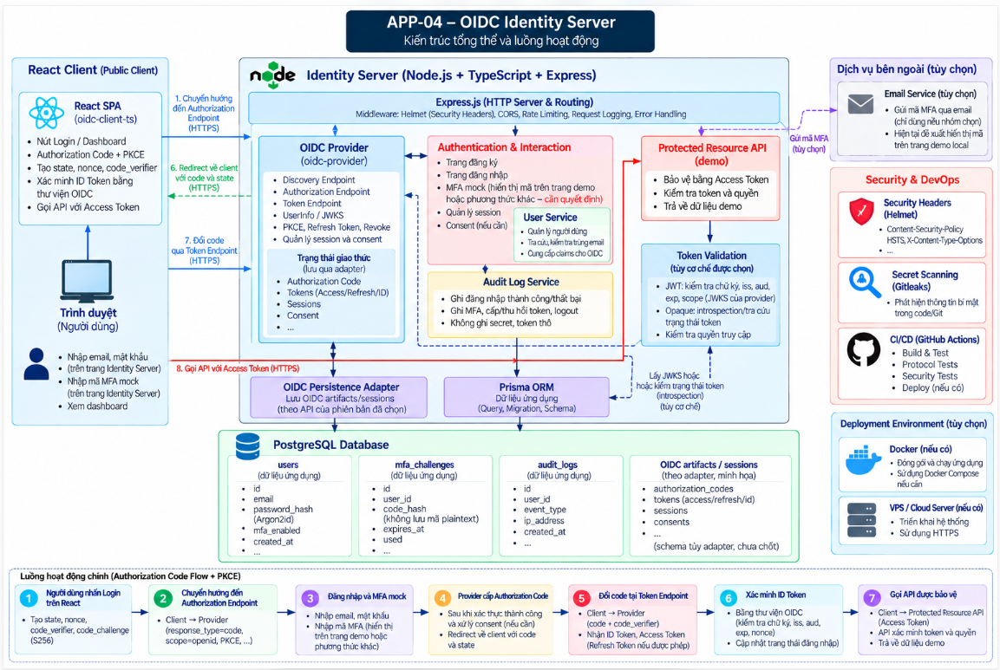
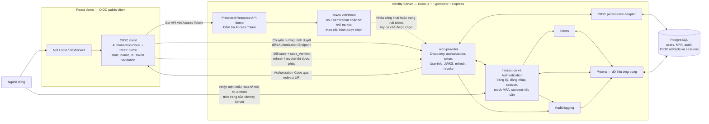

# Sơ đồ kiến trúc APP-04 — bản để review

**Trạng thái:** Đề xuất, chưa chốt các chi tiết cấu hình `oidc-provider` và chính sách token. Xem phạm vi và tiêu chí nghiệm thu trong [architecture.md](architecture.md).

## Sơ đồ tổng quan dạng ảnh



## 1. Sơ đồ thành phần



**Cách đọc:** React demo là một OIDC Relying Party thuộc loại public client; không có một confidential client thứ hai trong MVP. Protected Resource API là module demo trong cùng Identity Server và phải xác minh Access Token trước khi trả dữ liệu. Mũi tên nét đứt thể hiện phụ thuộc logic vào khóa/trạng thái của provider, **không khẳng định có lời gọi mạng đến provider**. Cơ chế JWT hay opaque token chưa được chốt. `oidc-provider` lưu trạng thái giao thức qua adapter; Prisma phục vụ dữ liệu ứng dụng. Các endpoint OIDC phải lấy từ Discovery Endpoint và cấu hình thực tế.

## 2. Luồng Authorization Code + PKCE

```mermaid
sequenceDiagram
    actor User as Người dùng
    participant Client as React OIDC client
    participant Provider as oidc-provider
    participant Auth as Authentication + mock MFA
    participant Resource as Protected Resource API

    User->>Client: Nhấn Login
    Client->>Client: Tạo state, nonce, code_verifier và S256 challenge
    Client->>Provider: Chuyển hướng đến Authorization Endpoint
    Provider->>Provider: Kiểm tra client, redirect URI và PKCE challenge
    Provider->>Auth: Yêu cầu interaction đăng nhập
    User->>Auth: Nhập email và mật khẩu
    Auth->>Auth: Tạo challenge MFA mock có hạn dùng
    Auth-->>User: Hiển thị trang MFA và demo code trong môi trường local
    User->>Auth: Nhập demo code
    Auth->>Auth: Kiểm tra hạn dùng, số lần thử và chống dùng lại
    Auth-->>Provider: Hoàn tất interaction khi hợp lệ
    Provider-->>Client: Redirect về callback với code và state
    Client->>Client: Đối chiếu state
    Client->>Provider: Đổi code bằng code_verifier
    Provider-->>Client: ID Token, Access Token; Refresh Token nếu được phép
    Client->>Client: Xác minh ID Token và nonce
    Client->>Resource: Gọi API với Access Token
    Resource->>Resource: Xác minh token và quyền theo cơ chế đã chốt
    Resource-->>Client: Dữ liệu demo nếu token hợp lệ
```

## 3. Kiểm soát bảo mật và phần chưa chốt

| Vị trí | Kiểm soát cần thể hiện khi triển khai |
| --- | --- |
| Form đăng nhập/MFA | CSRF protection, giới hạn số lần thử, hash mật khẩu bằng Argon2id, cookie/session phù hợp |
| OIDC endpoints | Redirect URI đăng ký chính xác, PKCE S256, thời hạn và chống dùng lại Authorization Code |
| React client | Kiểm tra `state`, `nonce`, ID Token; xác định rõ cách giữ token, tránh lưu Refresh Token trong `localStorage` |
| Protected Resource API | Xác minh Access Token và quyền theo định dạng/cơ chế thực tế; từ chối token sai, hết hạn hoặc thiếu quyền |
| Toàn hệ thống | Security headers, audit không chứa secret/token thô, HTTPS ngoài local, secret scanning |

**Cần nhóm quyết định:** chính sách cấp và rotation Refresh Token cho public client, cách xác minh Access Token ở API demo, luồng logout ở client và Identity Server, cấu hình consent, cách trình bày mã MFA mock trong demo và schema persistence adapter theo phiên bản `oidc-provider` đã chọn. Đề xuất hiện tại là hiển thị mã mô phỏng trên trang MFA ở môi trường local với nhãn rõ ràng; mã không được ghi vào audit log.

Khi test revocation, cần phân biệt Refresh Token bị thu hồi với Access Token đã cấp. Thu hồi Refresh Token phải chặn lần refresh tiếp theo; Access Token chỉ bị vô hiệu hóa ngay nếu chính sách/cơ chế đã chọn hỗ trợ điều đó.

Docker, VPS, API quản trị client và một confidential client riêng không nằm trong sơ đồ MVP; nhóm có thể bổ sung sau khi luồng chính hoạt động.
