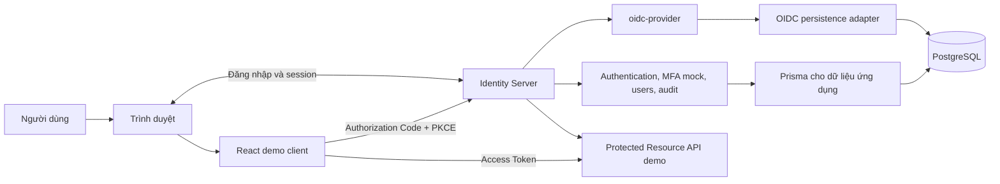

# Đề xuất kiến trúc hệ thống APP-04

**Dự án:** OIDC Identity Server và ứng dụng mẫu  
**Nhóm:** SE2026-T28 (4 thành viên)  
**Thời gian dự kiến:** 8 tuần  
**Trạng thái:** Bản đề xuất để nhóm review; chưa phải thiết kế cuối cùng

## 1. Mục tiêu và phạm vi

Xây dựng một Identity Server có thể phục vụ nhiều OIDC client, dùng một ứng dụng React để chứng minh luồng đăng nhập. Dự án sử dụng thư viện triển khai giao thức OIDC thay vì tự viết Authorization Code, Token Endpoint hoặc thuật toán mật mã.

### MVP bắt buộc

| Nhóm yêu cầu | Kết quả cần có |
| --- | --- |
| Tài khoản | Đăng ký, đăng nhập bằng email và mật khẩu, đăng xuất, quản lý session |
| OIDC | Authorization Code Flow với PKCE S256, redirect URI được kiểm tra, `state` và `nonce`, cấp và xác minh ID Token |
| Token | Access Token, ID Token, Refresh Token, refresh grant, token revocation và thời hạn hiệu lực |
| MFA mock | Một bước xác minh mô phỏng sau mật khẩu, có trạng thái thành công/thất bại; ghi rõ không phải MFA đủ an toàn cho production |
| Audit | Ghi đăng nhập thành công/thất bại, MFA, cấp/thu hồi token và logout; không ghi secret hoặc token thô |
| Demo client | Login, callback, dashboard được bảo vệ, hồ sơ người dùng và logout |

### Minh chứng phải có trong GitHub

- Protocol tests cho luồng hợp lệ và lỗi: PKCE sai/thiếu, redirect URI sai, code hết hạn/dùng lại, token sai/hết hạn, refresh và revoke.
- Threat model với biện pháp giảm thiểu cho code interception, token theft, CSRF, XSS, brute force, redirect URI manipulation và credential leakage.
- Security headers, secret scanning và security review checklist.
- Hướng dẫn chạy, cấu hình `.env.example` không chứa credential thật và kịch bản demo có thể lặp lại.

## 2. Kiến trúc được đề xuất

Chọn **Modular Monolith**: một Identity Server Node.js chia module theo trách nhiệm, một React demo client và một PostgreSQL. Một Protected Resource API nhỏ nằm trong Identity Server để chứng minh Access Token có thể gọi tài nguyên được bảo vệ; chỉ tách thành service riêng nếu nhóm có nhu cầu rõ ràng sau khi MVP hoạt động.



Sơ đồ chi tiết và luồng tuần tự nằm trong [architecture-diagram.md](architecture-diagram.md).

### Ranh giới trách nhiệm

| Thành phần | Trách nhiệm |
| --- | --- |
| `oidc-provider` | Discovery, authorization, token, UserInfo/JWKS khi được cấu hình, PKCE, refresh/revoke và trạng thái giao thức |
| Authentication/interaction | Giao diện đăng nhập thuộc Identity Server, kiểm tra mật khẩu, nối kết quả đăng nhập/MFA với interaction của provider |
| Users | Đăng ký, tra cứu người dùng, kiểm tra email trùng và cung cấp claims cần thiết |
| MFA mock | Tạo và xác minh thử thách mô phỏng, giới hạn thử sai, hết hạn và chống dùng lại |
| Audit | Ghi sự kiện bảo mật từ auth và provider, lọc dữ liệu nhạy cảm |
| Persistence adapter | Lưu các artifact/session cần thiết của provider vào PostgreSQL theo API của phiên bản đã chọn |
| Protected Resource API | Kiểm tra Access Token theo định dạng và cơ chế provider cấu hình, trả về dữ liệu demo |
| React client | Khởi tạo OIDC, xử lý callback, xác minh ID Token, hiển thị trạng thái người dùng; không nhận mật khẩu |

Express chỉ làm lớp HTTP cho các route ứng dụng và tích hợp provider. Không viết lại chức năng giao thức mà `oidc-provider` đã cung cấp.

## 3. Công nghệ dự kiến

| Thành phần | Lựa chọn | Ghi chú |
| --- | --- | --- |
| Identity Server | Node.js, TypeScript, Express, `oidc-provider` | Xác nhận phiên bản và API tương thích trước khi cài |
| Demo client | React, Vite, TypeScript, thư viện OIDC client phù hợp | `oidc-client-ts` là ứng viên, cần thử luồng thực tế trước khi chốt |
| Dữ liệu | PostgreSQL, Prisma | Prisma cho dữ liệu ứng dụng; adapter của provider tuân theo API thư viện |
| Mật khẩu | Argon2id qua thư viện được duy trì | Không tự triển khai thuật toán băm |
| Kiểm thử | Vitest hoặc Jest; Playwright cho E2E nếu cần | Ưu tiên protocol/integration tests có ý nghĩa |
| Bảo mật và CI | Security headers, secret scanning, GitHub Actions | Chọn công cụ cụ thể khi thiết lập CI |

Docker Compose **không thuộc phạm vi mặc định**. Ưu tiên chạy local ổn định; chỉ thêm container hóa nếu nhóm quyết định cần cho tích hợp hoặc demo.

## 4. Luồng đăng nhập chính

1. Người dùng nhấn Login trên React client.
2. Client tạo `state`, `nonce`, `code_verifier` và `code_challenge` S256 riêng cho lần đăng nhập; lưu tạm dữ liệu giao dịch theo cơ chế của thư viện client.
3. Trình duyệt chuyển đến Authorization Endpoint với `client_id`, `redirect_uri`, `scope=openid`, `response_type=code` và PKCE challenge.
4. Provider kiểm tra yêu cầu và chuyển đến interaction đăng nhập khi chưa có session phù hợp.
5. Identity Server kiểm tra mật khẩu, thực hiện MFA mock, hoàn tất interaction và consent nếu chính sách yêu cầu.
6. Provider chuyển trình duyệt về `redirect_uri` đã đăng ký cùng Authorization Code và `state`.
7. Client đối chiếu `state`, đổi code tại Token Endpoint bằng `code_verifier` và nhận token.
8. Client xác minh ID Token bằng thư viện OIDC: chữ ký, `iss`, `aud`, thời hạn và `nonce` khi đã gửi; chỉ sau đó mới coi người dùng đã đăng nhập.
9. Client dùng Access Token để gọi Protected Resource API demo; API kiểm tra token theo cơ chế đã chốt rồi mới trả dữ liệu. Refresh Token chỉ được cấp nếu chính sách client/provider cho phép.

`state`, `nonce` và PKCE có mục đích khác nhau; không dùng một giá trị thay cho cả ba. PKCE S256 là yêu cầu cho public client theo [OAuth 2.0 Security Best Current Practice](https://www.rfc-editor.org/rfc/rfc9700.html). Quy tắc kiểm tra ID Token dựa trên [OpenID Connect Core](https://openid.net/specs/openid-connect-core-1_0-18.html).

### Kịch bản MFA mock cho demo

Sau khi mật khẩu đúng, Identity Server tạo một challenge có thời hạn rồi hiển thị trang nhập mã thuộc Identity Server. **Đề xuất cho môi trường demo local:** hiện mã mô phỏng ngay trên trang này kèm nhãn “Demo code”; không gửi email và không coi đây là yếu tố xác thực độc lập. Mã chỉ dùng một lần, có giới hạn số lần nhập sai và không được ghi vào audit log. Chỉ hoàn tất OIDC interaction sau khi challenge hợp lệ. Nhóm cần chốt cách cung cấp mã trước khi làm UI và test MFA.

## 5. Refresh, revoke và logout

- **Refresh:** xác định rõ điều kiện cấp Refresh Token cho demo client, thời hạn, có rotation hay không và hành vi khi refresh thất bại. Không mặc định rằng mọi lần đăng nhập đều nhận Refresh Token.
- **Lưu token:** tránh lưu Refresh Token trong `localStorage`; chốt cách thư viện client giữ token và cách khôi phục trạng thái khi tải lại trang trước khi triển khai.
- **Revoke:** test phải chỉ rõ token nào bị thu hồi và kết quả mong đợi. Thu hồi Refresh Token phải chặn lần refresh tiếp theo; việc Access Token đã cấp còn hiệu lực hay không phụ thuộc chính sách, thời hạn và cơ chế xác minh đã chọn.
- **Logout:** xóa trạng thái ở React client và kết thúc session tại Identity Server theo khả năng OIDC logout được cấu hình. Kiểm thử trường hợp sau logout người dùng truy cập lại route được bảo vệ.

Chính sách rotation, định dạng Access Token và cách resource API xác minh token là **quyết định còn mở**; cần chốt trước khi triển khai refresh/Protected Resource API. Nếu chọn JWT, API cần kiểm tra chữ ký, issuer, audience, thời hạn và quyền truy cập. Nếu chọn opaque token, API cần một cơ chế tra cứu/trạng thái phù hợp với provider, ví dụ introspection nếu được hỗ trợ và cấu hình. Không giả định Access Token luôn là JWT.

### Hợp đồng tích hợp tối thiểu

| Nhóm endpoint/interaction | Bên phụ trách | Điều cần thống nhất |
| --- | --- | --- |
| Discovery, authorization, token, UserInfo, JWKS, revocation | `oidc-provider` | Client lấy endpoint từ Discovery; kiểm tra tính năng thực tế theo cấu hình |
| Đăng ký tài khoản | Users/Authentication | Dữ liệu đầu vào, lỗi trùng email, cách chuyển sang đăng nhập |
| Login, MFA và consent nếu cần | Authentication/Interaction | Session, challenge, kết quả trả về provider, CSRF protection |
| Protected Resource API demo | Resource API | Phạm vi truy cập, định dạng lỗi và cơ chế xác minh Access Token |
| Logout | React client phối hợp Identity Server | Xóa trạng thái client, kết thúc session provider và redirect sau logout |

Đây là **ranh giới trách nhiệm**, chưa phải danh sách URL cố định. Nhóm chỉ chốt path và request/response chi tiết sau khi thử cấu hình provider; URL OIDC công bố qua Discovery Endpoint.

## 6. Thiết kế dữ liệu sơ bộ

| Bảng/nhóm dữ liệu | Nội dung chính |
| --- | --- |
| `users` | ID, email duy nhất, password hash, thời điểm tạo/cập nhật |
| `mfa_challenges` | User ID, hash của mã mô phỏng, hạn dùng, số lần thử, thời điểm đã dùng |
| `audit_logs` | Loại sự kiện, thời gian, user ID nullable, client ID và metadata đã lọc |
| OIDC artifacts | Payload và các khóa tra cứu/hạn dùng theo yêu cầu của persistence adapter |

Đây là mô hình để thảo luận, **chưa phải migration cuối**. Trước khi viết schema OIDC artifacts, phải kiểm tra giao diện adapter của phiên bản `oidc-provider` được cài, gồm lưu, tra cứu, hết hạn, thu hồi và các chỉ mục cần thiết. Không lưu mật khẩu, mã MFA hay raw token trong audit log.

## 7. Bảo mật tối thiểu

- Chỉ chấp nhận redirect URI đã đăng ký; không dùng so khớp tiền tố tùy tiện.
- Dùng PKCE S256; kiểm tra `state`, `nonce` và ID Token tại client.
- Hash mật khẩu, giới hạn thử đăng nhập/MFA và dùng thông báo lỗi không làm lộ tài khoản.
- Áp dụng CSRF protection cho form/interaction phù hợp, cấu hình cookie và CORS theo đúng origin sử dụng.
- Bật Content-Security-Policy, X-Content-Type-Options, Referrer-Policy; bật HSTS khi chạy HTTPS.
- Dùng HTTPS ngoài local; giữ signing keys và database credentials ngoài Git, cung cấp `.env.example` chỉ có giá trị mẫu.
- Lọc URL, headers và metadata trong audit để không ghi Authorization Code, token, mật khẩu, mã MFA hoặc secret.
- Mô tả rõ MFA mock chỉ minh họa trình tự xác thực, không chứng minh bảo mật của yếu tố thứ hai độc lập.

## 8. Kiểm thử và tiêu chí nghiệm thu

| Nhóm | Trường hợp tối thiểu | Bằng chứng đạt |
| --- | --- | --- |
| Discovery | Truy cập `/.well-known/openid-configuration` | Metadata có issuer và endpoint khớp cấu hình local |
| Đăng nhập | Người dùng từ React login và quay lại dashboard | ID Token hợp lệ, đúng user; route được bảo vệ hoạt động |
| PKCE/code | Verifier sai/thiếu, code hết hạn hoặc dùng lại | Token Endpoint từ chối yêu cầu |
| Redirect và callback | Redirect URI sai, `state`/`nonce` sai | Provider/client từ chối tương ứng |
| Token | Hết hạn, refresh và revoke từng loại token | Refresh Token bị revoke không refresh được; Access Token đã cấp được kiểm tra theo chính sách đã ghi |
| Protected API | Access Token hợp lệ, sai, hết hạn, thiếu quyền | API chỉ trả dữ liệu khi token được xác minh và đủ quyền |
| MFA mock | Đúng, sai, hết hạn, thử quá giới hạn, dùng lại | Kết quả đăng nhập và audit phù hợp |
| Audit | Login, MFA, issuance, revoke, logout | Có sự kiện cần thiết và không có dữ liệu nhạy cảm |
| Bảo mật | Headers, secret scanning, threat model | Kết quả CI và tài liệu trong repo |

Không tuyên bố một luồng đạt chuẩn chỉ vì UI hiển thị “đăng nhập thành công”; cần kiểm tra phản hồi giao thức và trường hợp lỗi.

## 9. Lộ trình triển khai

| Mốc | Kết quả có thể review |
| --- | --- |
| 1. Nền tảng | Identity Server chạy local; Discovery Endpoint trả metadata đúng; hướng dẫn chạy được ghi lại |
| 2. Luồng xuyên suốt | React → authorization → login → callback → token → xác minh ID Token → dashboard |
| 3. MVP chức năng | Signup, session/logout, mock MFA, refresh/revoke, audit và Protected Resource API demo |
| 4. Minh chứng | Protocol/security tests, threat model, headers, secret scanning, checklist và kịch bản demo |

Các mốc là thứ tự ưu tiên, **không biến tính năng của mốc 3 thành tùy chọn**. Nên viết các test giao thức song song khi mốc 2 hoạt động, không chờ đến cuối dự án.

### Kế hoạch tham khảo theo 8 tuần

| Tuần | Kết quả ưu tiên |
| --- | --- |
| 1 | Thống nhất kiến trúc, phạm vi MVP, hợp đồng tích hợp, vai trò và cách chạy local |
| 2 | Khởi tạo Identity Server, kiểm tra phiên bản thư viện, Discovery Endpoint và kết nối PostgreSQL cơ bản |
| 3 | Đăng ký/đăng nhập, interaction, React OIDC client và khởi tạo Authorization Code + PKCE |
| 4 | Hoàn thành luồng đăng nhập xuyên suốt; viết test cho callback, PKCE, redirect URI và code |
| 5 | Session/logout, MFA mock, chính sách Refresh Token, refresh/revoke và test tương ứng |
| 6 | Audit, Protected Resource API, xác minh Access Token và kiểm thử tích hợp |
| 7 | Bổ sung protocol/security tests, threat model, headers, secret scanning; sửa lỗi được phát hiện |
| 8 | Kiểm thử cuối, hoàn thiện hướng dẫn chạy, checklist, kịch bản demo và trình bày |

Timeline là dự kiến; nếu luồng xuyên suốt chậm hơn kế hoạch, ưu tiên xử lý tích hợp trước khi thêm phần mở rộng. Các bài test bắt đầu từ tuần 3–4, không dồn sang tuần 7.

## 10. Phân chia công việc đề xuất

| Thành viên | Trách nhiệm chính | Điểm tích hợp cần thống nhất |
| --- | --- | --- |
| 1 | Users, đăng ký/đăng nhập, session, mock MFA | Giao diện trả kết quả xác thực cho interaction |
| 2 | `oidc-provider`, cấu hình client, adapter, refresh/revoke | Issuer, redirect URI, claims, chính sách token |
| 3 | React client, callback, dashboard, protected routes, logout | Client ID, scopes, API contract và logout flow |
| 4 | Protocol/security tests, audit, threat model, CI và tài liệu | Danh sách event, test fixtures và tiêu chí nghiệm thu |

Một người cần nhận vai trò **phụ trách tích hợp luồng đăng nhập xuyên suốt**; nhóm chốt người này khi chia task. Mỗi thay đổi liên quan giao thức cần được thử cùng client trước khi coi là hoàn thành.

## 11. Cấu trúc repo dự kiến

```text
SE2026-T28/
├── identity-server/
│   ├── src/
│   │   ├── provider/       # cấu hình, adapter, events
│   │   ├── interactions/   # login, MFA mock, consent
│   │   ├── users/
│   │   ├── audit/
│   │   ├── resource-api/   # API demo được bảo vệ
│   │   └── config/
│   └── prisma/
├── client-demo/
│   └── src/
│       ├── auth/
│       ├── pages/
│       └── components/
├── tests/
│   ├── protocol/
│   ├── integration/
│   └── security/
├── docs/
│   ├── architecture.md
│   ├── threat-model.md
│   └── security-checklist.md
├── .env.example
└── README.md
```

Thư mục chỉ được tạo khi có code/tài liệu tương ứng. Repo hiện tại mới có README và các thư mục khung; chưa có triển khai để xác nhận những quyết định kỹ thuật này.

## 12. Quyết định cần nhóm chốt trước khi code đáng kể

1. Phiên bản Node.js, `oidc-provider` và thư viện OIDC client; kiểm tra tương thích API trước khi khóa dependency.
2. Chính sách client: scopes, redirect/logout URI, điều kiện cấp Refresh Token, rotation và cách client giữ token; chốt trước khi làm refresh.
3. Định dạng Access Token và cơ chế Protected Resource API xác minh token; chốt trước khi làm API demo.
4. Hành vi logout ở client và Identity Server; consent có cần giao diện riêng không; cách hiển thị mã MFA mock trong demo.
5. Thiết kế adapter PostgreSQL dựa trên API provider thực tế.
6. Người phụ trách tích hợp, hợp đồng giữa module, quy tắc branch/PR và tiêu chí review.

**Mốc kỹ thuật đầu tiên:** chạy Identity Server tối thiểu và đọc được Discovery Endpoint. Sau mốc đó, ưu tiên hoàn thành một luồng Authorization Code + PKCE xuyên suốt trước khi mở rộng các chức năng còn lại của MVP.
